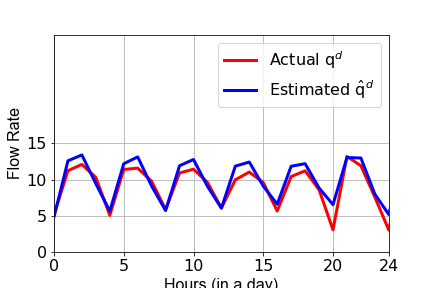
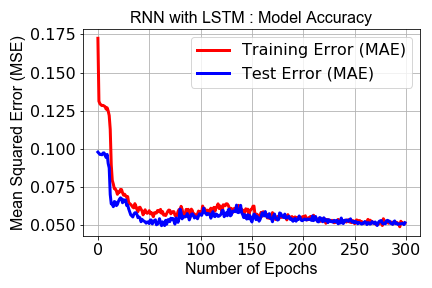

# time-ahead-estimation-RNN

This is a classical **prediction problem** solved by the Recurrent Neural Networks assisted by dropouts. One of the key challenges in any Machine Learning (ML) driven-control formulation is the estimation of some of the independent variables. In major applications of ML (such as Autonomous cars, real-time image processing, industrial control, etc.), the user is expected to perform time-ahead estimation of some of the key independent variables. One such example is the time-ahead estimation of independent variables such as dynamic energy price  {πt} and expected user water demand {dt}. In this work, we present a code; which can potentially estimate/predict the time-ahead expected water demand given the historical data. 

  
  *An example of a Water Distribution Network [a. Estimated Vs Actual] [b. Training Loss]:

   
  

# Requirements:
- [`TensorFlow`](https://www.tensorflow.org/)
- [`Keras`](https://keras.io/)
- [`numpy`](https://numpy.org/devdocs/)
- [`matplotlib`](https://matplotlib.org/)
- [`pandas`](https://pandas.pydata.org/)
- [`jupyter`](https://jupyter.org/)

## Installation
This framework is suitable for Python >= 3.7 environment. In addition, the historical time series data is obtained from the designed IoT infrastructure; which is not demonstrated in this repository.

## License
The project is licensed under the [GNU General Public License v3.0](https://www.gnu.org/licenses/gpl-3.0.en.html).

## Funding
This work was funded by:

 [Wisenet Research Center (UiA)](https://wisenet.uia.no/) 
 Norsk institutt for vannforskning (https://www.niva.no/) 
